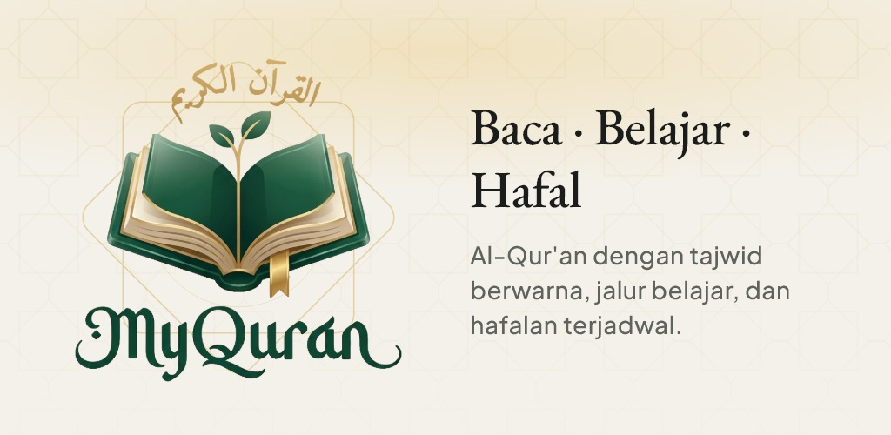
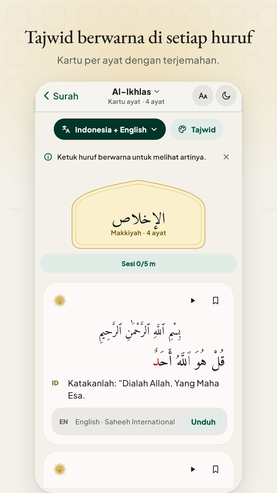
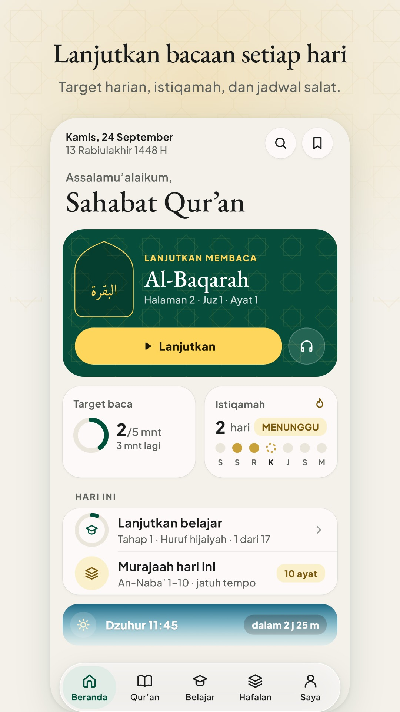
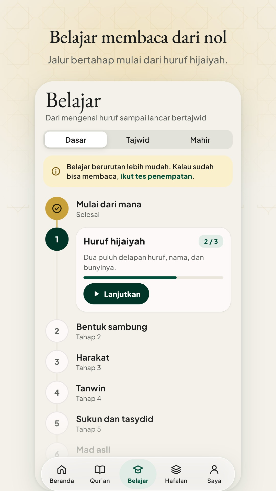
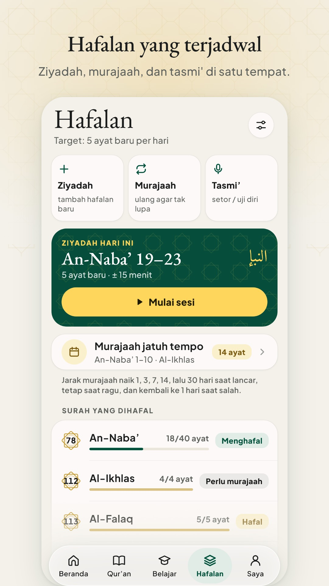
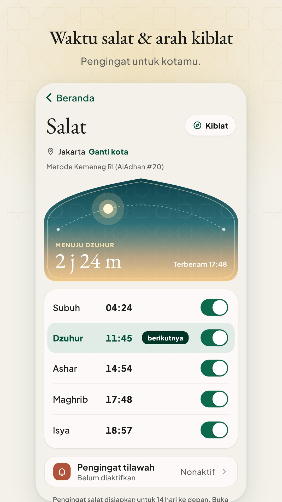

<div align="center">


# MyQuran

**Baca, belajar tajwid, dan hafalkan Al-Qur'an dalam satu aplikasi yang tenang.**<br>
Gratis · tanpa iklan · tanpa pembelian · tetap bisa dipakai tanpa internet

[](https://github.com/ZainulArkaanAlinsi/Qur-an_App/releases/latest)
[](#-unduh)
[](https://flutter.dev)
[](#-prinsip)

<a href="https://github.com/ZainulArkaanAlinsi/Qur-an_App/releases/latest/download/myquran.apk"><b>⬇️ Unduh APK terbaru</b></a>
&nbsp;·&nbsp;
<a href="https://quran-app-zainularkaan.web.app/privacy">Kebijakan privasi</a>
&nbsp;·&nbsp;
<a href="#-english">English</a>

<br><br>



</div>

<br>

<p align="center">
  
  
  
  
  
</p>

---

## ✨ Fitur

<table>
<tr>
<td width="50%" valign="top">

### 📖 Membaca
- **Kartu per ayat** dengan teks Uthmani dan terjemahan di bawahnya.
- **Tajwid berwarna.** Ketuk huruf berwarna untuk melihat nama hukumnya, contoh kata di ayat itu, dan tombol dengar.
- **Terjemahan beberapa bahasa**, bisa diunduh untuk dibaca tanpa internet.
- **Cari** surah, nomor ayat, atau kata dalam terjemahan.
- **Lompat ke ayat**, lanjut dari bacaan terakhir, dan **mode fokus** tanpa gangguan.
- **Kertas Gading, Sepia, atau Malam**, plus ukuran dan jarak baris teks Arab yang bisa diatur.

</td>
<td width="50%" valign="top">

### 🎧 Murottal
- Putar per ayat dan terus berlanjut, juga di **latar belakang** dengan kontrol di layar kunci.
- **Ulangi ayat** atau **rentang ayat** untuk murajaah.
- **Timer tidur**, atur kecepatan, dan **pilih qari**.
- **Unduh per surah** untuk didengar offline; ada mode hemat kuota.

</td>
</tr>
<tr>
<td valign="top">

### 🎓 Belajar
- Jalur bertahap dari **huruf hijaiyah**, bentuk sambung, harakat, tanwin, hingga sukun & tasydid.
- Latihan setiap langkah; soal yang salah diulang sampai benar.
- Titik mulai bisa dipilih: dari nol, langsung tajwid, atau hafalan.

</td>
<td valign="top">

### 🧠 Hafalan
- **Ziyadah, murajaah, dan tasmi'** dalam satu tempat, dengan target ayat per hari.
- Jadwal murajaah memberi tahu surah yang jatuh tempo.
- Ulangi ayat dan **rekam bacaanmu sendiri** (disimpan di HP).

</td>
</tr>
<tr>
<td valign="top">

### 🕌 Salat
- **Jadwal salat** (AlAdhan, metode Kemenag RI).
- **Pengingat tiap waktu salat** dan pengingat tilawah harian.
- **Arah kiblat** dengan GPS dan kompas.

</td>
<td valign="top">

### 📈 Progres & akun
- **Target baca harian** (5–30 menit), istiqamah, heatmap, dan **rencana khatam**.
- **Penanda ayat** dengan koleksi Umum, Hafalan, dan Favorit.
- **Masuk dengan Google (opsional)** untuk menyinkronkan sesi baca dan penanda. Akun dan data cloud bisa dihapus kapan saja.
- Tema **Terang/Gelap/Otomatis** dan palet **Hijau, Sepia, Kontras tinggi**.

</td>
</tr>
</table>

---

## 🤲 Prinsip

- **Teks ayat dan terjemahan tidak pernah diketik ulang, dibuat AI, atau diubah.** Semuanya diambil persis dari dataset berlisensi, dengan sumber dan versi yang disebutkan di aplikasi (*Saya › Sumber & lisensi*).
- **Materi tajwid tahap lanjut berstatus draf** dan dikunci ("Materi sedang ditinjau") sampai diperiksa guru tajwid.
- **Tidak ada iklan, langganan, pembelian, atau penjualan data.** Aplikasi ini proyek pelajar dan nonkomersial.
- **Nyaman untuk semua mata:** teks ≥ 4.5 : 1 di terang dan gelap, dukungan teks besar, palet kontras tinggi, dan menghormati pengaturan *kurangi gerak*.

---

## 📥 Unduh

| Sumber | Tautan |
| --- | --- |
| APK Android (langsung unduh, selalu versi terbaru) | [myquran.apk](https://github.com/ZainulArkaanAlinsi/Qur-an_App/releases/latest/download/myquran.apk) |
| Semua rilis dan catatan perubahan | [GitHub Releases](https://github.com/ZainulArkaanAlinsi/Qur-an_App/releases) |
| Google Play | Segera |

Butuh Android 7.0 atau lebih baru. APK GitHub ditandatangani dengan kunci rilis yang sama di setiap versi, dan aplikasinya bisa memperbarui diri sendiri.

---

## 📚 Sumber data & lisensi

| Data | Sumber | Lisensi / syarat |
| --- | --- | --- |
| Teks Al-Qur'an | [Tanzil](https://tanzil.net) Uthmani 1.0.2 | CC BY 3.0, salinan persis |
| Terjemahan Indonesia | Kementerian Agama RI (via Tanzil) | Nonkomersial, dengan atribusi |
| Terjemahan bahasa lain | [QuranEnc](https://quranenc.com) | Tanpa diubah, sebut sumber & versi |
| Data warna tajwid | [cpfair/quran-tajweed](https://github.com/cpfair/quran-tajweed) | CC BY 4.0 |
| Audio murottal | Islamic Network (alquran.cloud), MP3Quran, equran.id | Rekaman milik qari/penerbitnya |
| Jadwal salat | [AlAdhan](https://aladhan.com) | API gratis |
| Font | Plus Jakarta Sans, EB Garamond, Amiri, Amiri Quran | SIL OFL 1.1 |

Surat permohonan izin kepada tiap pemilik data ada di [`docs/lisensi/`](docs/lisensi/).

---

## 🛠️ Teknologi

- **Flutter 3.44 / Dart 3.12.** State memakai `ChangeNotifier` + `InheritedNotifier` bawaan Flutter, tanpa paket state management.
- **Sistem desain "Sacred Serenity"**: semua warna, jarak, dan huruf dari token (`SacredTokens`, `SacredText`), dengan komponen sendiri gaya iOS.
- **Audio:** `just_audio` + `audio_service`. **Notifikasi:** `flutter_local_notifications`. **Cloud:** Firebase Auth + Firestore (opsional).
- **Kualitas:** puluhan tes unit dan widget, serta **golden test** tiap layar di ukuran 390×844 (terang, gelap, teks 2×) dengan font asli.

<details>
<summary><b>Menjalankan dari kode sumber</b></summary>

```bash
flutter pub get
flutter run
```

```bash
dart format lib test
flutter analyze
flutter test                       # termasuk golden
flutter test --update-goldens test/golden/
```

Build APK rilis GitHub (butuh kunci rilis): `pwsh tool/build_release.ps1`.
Panduan rilis: [`docs/RELEASE.md`](docs/RELEASE.md) dan [`docs/PLAY_STORE_RELEASE.md`](docs/PLAY_STORE_RELEASE.md).

</details>

<details>
<summary><b>Struktur proyek</b></summary>

```
lib/
  app/         tema, token desain, komponen UI, shell tab
  features/    belajar, tajwid, murottal, pembaca, onboarding, hafalan
  screens/     layar utama (Beranda, Qur'an, pembaca, Saya, salat, …)
  services/    audio, preferensi, jadwal salat, sinkron cloud, pengingat
  data/        repositori teks, terjemahan, juz, halaman
assets/        teks Al-Qur'an, terjemahan, data tajwid, materi belajar, font, logo
docs/          desain (v2, v3), rilis, Play Store, lisensi
test/          tes unit, widget, dan golden
```

</details>

---

## 🗺️ Sedang dikerjakan

- **Tampilan mushaf 1 dan 2 halaman.** Menunggu izin tertulis untuk data tata letak Mushaf Madinah.
- **Materi tajwid tahap lanjut** (mad, tajwid lanjutan, gharib). Sedang ditinjau guru tajwid.
- **Efek kaca ("liquid glass") untuk tab bar, nav pembaca, dan pemutar.**

---

## 🌍 English

**MyQuran** is a free, ad-free Android app for reading the Qur'an, learning tajweed, and memorising, built with Flutter. It offers:
- verse cards with colour-coded tajweed you can tap for an explanation;
- translations in several languages (downloadable for offline use);
- verse-by-verse recitation with repeat ranges, a sleep timer, and offline downloads;
- a step-by-step reading course starting from the Arabic alphabet;
- a memorisation planner (ziyadah, murajaah, tasmi');
- prayer times with reminders and a qibla compass;
- reading goals, streaks, and optional Google sign-in sync.

The Qur'an text and translations come verbatim from licensed datasets (Tanzil, Kemenag, QuranEnc), and are never retyped or AI-generated.

[Download the latest APK](https://github.com/ZainulArkaanAlinsi/Qur-an_App/releases/latest/download/myquran.apk) · Android 7.0+

---

<div align="center">

Dibuat oleh **Zainul Arkaan** sebagai proyek pelajar.<br>
Hak cipta kode © 2026 Zainul Arkaan. Data dan aset pihak ketiga mengikuti lisensinya masing-masing.

<sub>Semoga bermanfaat. Jika menemukan kesalahan pada teks atau terjemahan, mohon laporkan lewat <a href="https://github.com/ZainulArkaanAlinsi/Qur-an_App/issues">Issues</a>.</sub>

</div>
